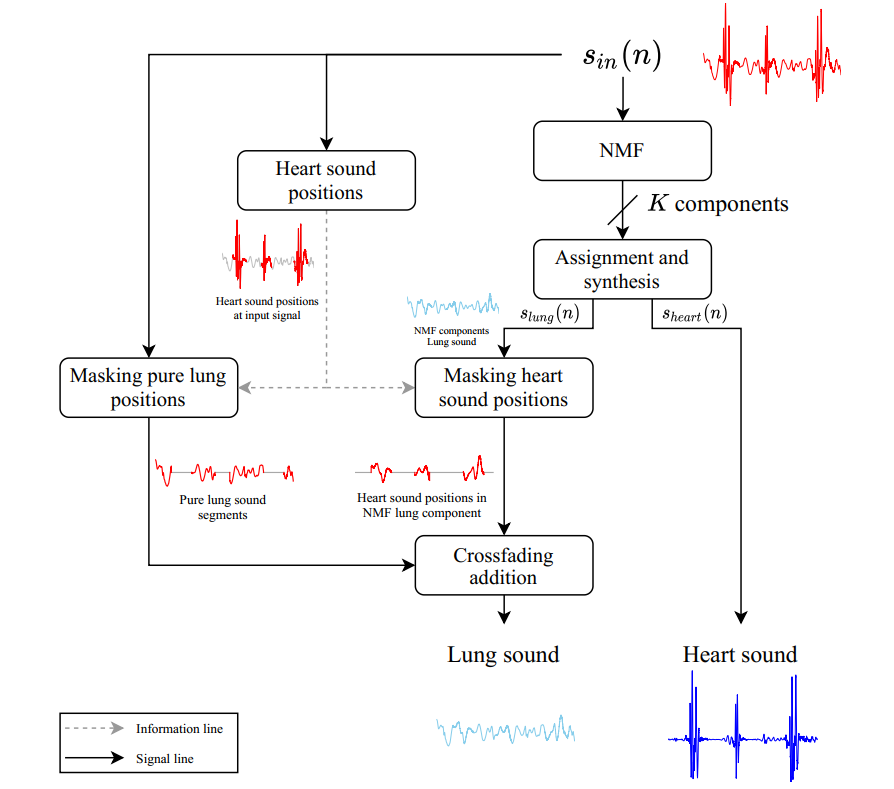

# Lung and heart sound separation

This repository contains the codes used for the development of a system for the separation of lung and heart sounds using Non-negative Matrix Factorization (NMF). This model allows to obtain a clean respiratory and cardiac sound from an auscultation sound of the chest, which is usually a mixture of both sounds. 

The development of this project was performed in the context of my Master of Engineering Sciences research entitled "[*Design of a preprocessing system for sounds obtained from chest auscultation*](https://repositorio.uc.cl/handle/11534/60994)" at Pontificia Universidad Catolica de Chile.

## 1. Theoretical background

Lung sounds are produced by a turbulent flow of air within the respiratory tract during inhalation and exhalation processes, mainly in the bronchi and trachea. This flow propagates in the form of sound thorugh the lung tissues which can be heard over the chest wall. Auscultation of breath sounds can provide signs of excessive secretions or evidence of inflammation of the lungs, which may be related to diseasses such as asthma, tuberculosis, chronic obstructions, pneumonia and bronchiectasis. 

Los sonidos cardiacos son señales cuasi periódicas originadas por el flujo de sangre que circula a través del corazón en conjunto con el movimiento de su propia estructura. Sus principales componentes corresponden al primer sonido cardiaco (S1) generado durante el cierre de las válvulas atrioventriculares, en el cual los ventrículos se contraen y permiten que la sangre sea bombeada desde el corazón hacia el resto del cuerpo a través de las arterias aorta y pulmonar. El segundo sonido cardiaco (S2) ocurre durante el cierre de las válvulas sigmoideas/semilunares en el cual los ventrículos se relajan y permiten el ingreso de la sangre desde los atrios.

Debido a que el corazón y el pulmón se encuentran en zonas muy cercanas del cuerpo, es inevitable que los sonidos cardiacos y respiratorios registrados se interfieran mutuamente en tiempo y frecuencia. La separación entre los sonidos cardiacos y respiratorios en tiempo y frecuencia es de gran interés para los especialistas de ambas áreas (cardiólogos y neumólogos) ya que permitirá elaborar diagnósticos más precisos. 

En este trabajo, se utilizan distintas arquitecturas basadas en NMF para separar ambos sonidos. Sin embargo, la que según el estudio ofrece mejores resultados es la presentada en la figura 1.

<figure>
	<div style="text-align:center">
		
    </div>
	<figcaption align = "center"><b>Figure 1: Proposed NMF separation architecture.</b></figcaption>
</figure>


For more details on the conclusions of this work, please refer to the paper "[*Source separation for single channel thoracic cardio-respiratory sounds applying Non-negative Matrix Factorization (NMF) using a focused strategy on heart sound positions*](https://spie.org/Publications/Proceedings/Paper/10.1117/12.2669781?SSO=1)", or chapter 3 of the thesis "[*Design of a preprocessing system for sounds obtained from chest auscultation*](https://repositorio.uc.cl/handle/11534/60994)").

## 2. Database

Para la realización de este estudio, se utilizaron dos bases de datos. La primera es una base de sonidos respiratorios presentada en la [*International Conference on Biomedical Health Informatics*](https://bhichallenge.med.auth.gr/ICBHI_2017_Challenge) (ICBHI) del año 2017. Esta base fue creada por dos equipos de investigación en Grecia y Portugal usando distintos estetoscopios electrónicos. Esta base de datos contiene 920 grabaciones de un total de 126 pacientes, con duraciones de entre 10-90 segundos y muestreados a distintas frecuencias (44100, 10000 y 4000 Hz). Esta base de datos también está disponible en [Kaggle](https://www.kaggle.com/vbookshelf/respiratory-sound-database).

La segunda base de datos utilizada es de sonidos cardiacos, y fue presentada en el desafío planteado por [Bentley et al.](http://www.peterjbentley.com/heartchallenge/) durante el 2011, cuyo objetivo era la segmentación y clasificación de estos sonidos en base a enfermedades.

A partir de ambas bases se genera un conjunto de 12 sonidos cardiorrespiratorios a partir de la suma de sonidos cardiacos y sonidos respiratorios, asegurándose de que ambas señales posean la misma energía. Debido a que los sonidos cardiacos y respiratorios de las distintas bases de datos no poseen la misma frecuencia de muestreo en la mayoría de los casos, se remuestrearon todas las señales a 11025 Hz.

Con esta base de datos sintética de 12 sonidos cardiorrespiratorios se evaluó el desempeño de la separación de fuentes, ya que se conoce de manera previa tanto la señal respiratoria como la señal cardiaca. Por lo tanto, se pudo realizar comparaciones de forma directa entre las señales obtenidas y las señales originales.


## 3. Contenido del repositorio

Las carpetas que componen este proyecto son:

* `imgs`: Folder with images included in this `README`.
* `jupyter_test`: Contiene el archivo `testing_notebook.ipynb` que permite realizar experimentos del modelo presentado sobre los archivos disponibles en la carpeta `samples_test`.
* `models`: Contiene la red convolucional entrenada para la segmentación de sonidos cardiacos en formato `.h5`.
* `samples_test`: Contiene una pequeña muestra de la base de datos presentada en la [sección 2](#2-base-de-datos).
* `source_separation`: Contiene los archivos con las principales funciones utilizadas para los distintos tipos de separación de fuentes mediante NMF propuestos en la tesis. En general estas funciones operan a nivel de *backend*.
* `ss_utils`: Contiene funciones que permiten operar las funciones principales de separación.
* `heart_lung_separation.py`: Archivo que contiene las funciones que permiten aplicar la separación de fuentes mediante NMF a nivel usuario. Estas funciones son las que se implementan en `main.py` y  los ejemplos del script en `jupyter_test`.
* `heart_prediction.py`: Archivo que contiene las funciones que permiten aplicar la predicción de las posiciones de los sonidos cardiacos utilizando la red CNN con arquitectura *encoder-decoder*.
* `main.py`: Archivo que contiene un ejemplo de ejecución para la función que realiza la separación del sonido cardiorrespiratorio en sonido respiratorio y cardiaco.

## 4. Libraries required

Para el desarrollo de estos módulos se utilizó la siguiente lista de bibliotecas. Debido a que no se puede asegurar el correcto funcionamiento del repositorio para versiones posteriores de estas bibliotecas, se incorporará también la versión de cada una.

* [NumPy](https://numpy.org/) (1.18.4)
* [SciPy](https://scipy.org/) (1.5.4)
* [Scikit-learn](https://scikit-learn.org/stable/) (0.24.1)
* [Tensorflow](https://www.tensorflow.org/) (2.3.1) 
* [Matplotlib](https://matplotlib.org/) (3.3.2)
* [Soundfile](https://pysoundfile.readthedocs.io/en/latest/) (0.10.3)
* [PyWavelets](https://pywavelets.readthedocs.io/en/latest/) (1.0.3)
* [PyEMD](https://pyemd.readthedocs.io/en/latest/intro.html) (0.2.10)

## 5. Ejemplo de prueba

Un ejemplo de prueba se deja a disposición en el *notebook* de la dirección `jupyter_test/testing_notebook.ipynb`, el cual contiene una ejecución guiada de la función de predicción.

Se deja a continuación un código similar al disponible en el archivo `main.py`.

```python
import matplotlib.pyplot as plt
from ss_utils.filter_and_sampling import downsampling_signal
from heart_lung_separation import find_and_open_audio, nmf_lung_heart_separation

# Opening audio sample
filename = 'samples_test/123_1b1_Al_sc_Meditron.wav'
audio, samplerate = sf.read(filename)

# Getting the signals
lung_signal, heart_signal = \
        nmf_lung_heart_separation(audio, samplerate, 
                                  model_name='definitive_segnet_based')
```
